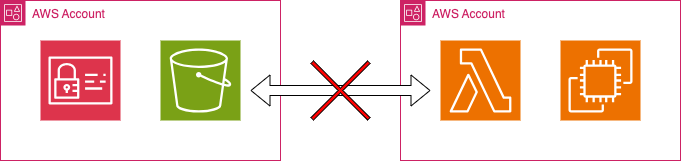
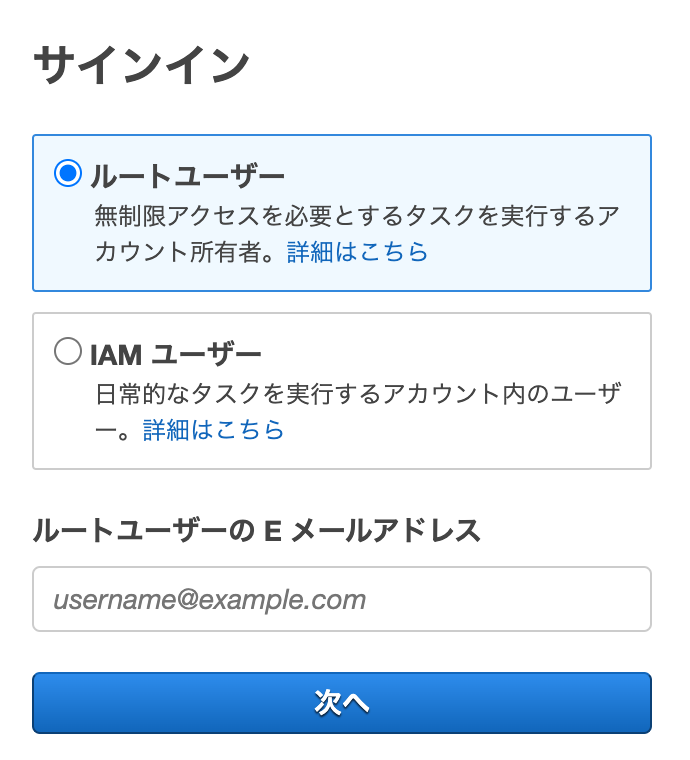
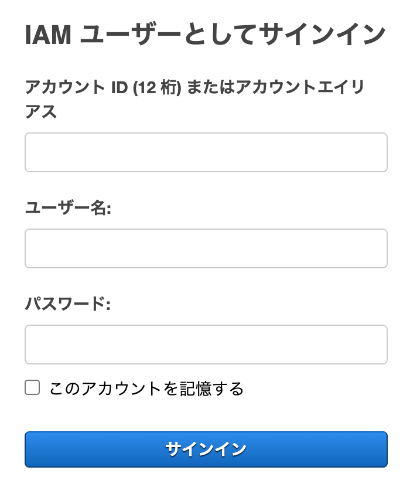

# AWSアカウントとルートユーザーとIAMユーザー

## そもそもアカウントとは？

一般的にアカウントとは、Wikipediaによると以下のことを指しています。

>　コンピュータ用語でのアカウント (英: account) は、ユーザーがネットワークやコンピュータやサイトなどにログインするための権利のことである。ユーザーに割り当てられたアカウントをユーザーアカウントとも呼ぶ。
>
> 引用: [Wikipedia](https://ja.wikipedia.org/wiki/%E3%82%A2%E3%82%AB%E3%82%A6%E3%83%B3%E3%83%88)

そういう意味では、AWSアカウントもルートユーザーもIAMユーザーもアカウントと呼びたくなってしまいます。

## AWSアカウント

**リソースのコンテナ**であり、リソースの**セキュリティ境界**である。 
12桁の数字にて表現された契約の単位である。

https://docs.aws.amazon.com/ja_jp/accounts/latest/reference/accounts-welcome.html

## ルートユーザー

アカウントの所有者。
AWSアカウントを作成する際に使用するメールアドレスとパスワードにて、AWSアカウントにログインすることができる。 
日常的な作業に使用するもの**ではない**。

https://docs.aws.amazon.com/ja_jp/accounts/latest/reference/root-user.html

## IAMユーザー

AWSが提供するリソースの一つ。 
AWSアカウント上にてリソースを作成したり、日常的な作業をするために使用する。

https://docs.aws.amazon.com/ja_jp/IAM/latest/UserGuide/id_users.html
