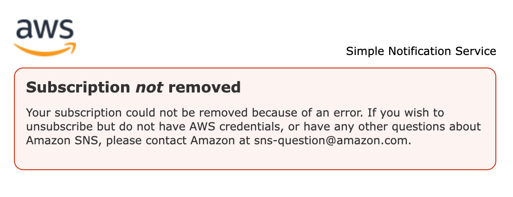

# メールを受信したユーザーがサブスクリプションを解除できてしまう

## 概要

AWS SNSを使用してEメールを送信した場合に、署名欄に以下が表示される

```text
[ERROR] First test message

--
If you wish to stop receiving notifications from this topic, please click or visit the link below to unsubscribe:
https://sns.{aws_region}.amazonaws.com/unsubscribe.html?SubscriptionArn={sns_subscription_arn}:{subscription_id}&Endpoint={mail_address}

Please do not reply directly to this email. If you have any questions or comments regarding this email, please contact us at https://aws.amazon.com/support
```

上記のリンクを押下することで、サブスクリプションが解除できてしまう

## 対処方法

> Amazon SNS トピック E メールのメーリングリストの受信者全員に対して、受信者登録を解除できないようにするには、AWS サポートからの登録解除に認証が必要な E メール受信登録を設定するを参照してください。

引用：https://docs.aws.amazon.com/ja_jp/sns/latest/dg/sns-email-notifications.html

[対処方法](https://repost.aws/ja/knowledge-center/prevent-unsubscribe-all-sns-topic)

## 結果



```text
Subscription not removed

Your subscription could not be removed because of an error. If you wish to unsubscribe but do not have AWS credentials, or have any other questions about Amazon SNS, please contact Amazon at sns-question@amazon.com.
```

## 課題

サブスクリプションが解除されてしまうことは解決できたが、AWSに問い合わせをすることができてしまう
